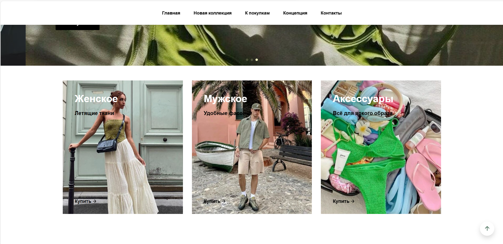
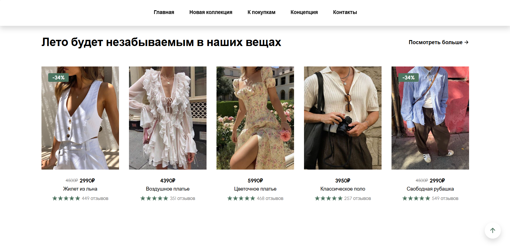
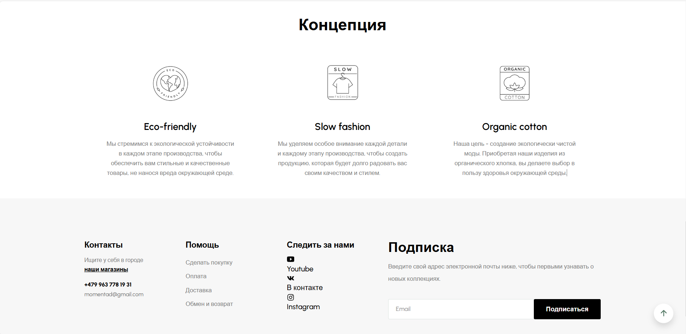

# clothes-shop
Итоги:

1. Создан макет онлайн магазина одежды в Figma: https://www.figma.com/design/OLLaYFFSVvihqkMbna9WmI/%D0%9C%D0%B0%D0%B3%D0%B0%D0%B7%D0%B8%D0%BD-%D0%BE%D0%B4%D0%B5%D0%B6%D0%B4%D1%8B-%22%D0%9C%D0%B3%D0%BD%D0%BE%D0%B2%D0%B5%D0%BD%D0%B8%D0%B5%22?node-id=1-7&t=0ppjC7evwZ88TfNX-1

2. Все элементы макета сверстаны с использованием семантических тегов.

3. Подключен и использован кастомный шрифт.

4. Макет адаптирован под мобильные устройства и планшеты с использованием медиазапросов.

5. Добавлены эффекты ховера на интерактивные элементы.

6. Реализована карусель с прокруткой с помощью библиотеки SwiperJS в блоке с главным баннером.

Скрины сайта:

